# Mini-PSPNet for Urban Land-Use/Land-Cover Classification of Remote Sensing images

## Introduction

This is the official implementation of [Mini-PSPNet for Urban Land-Use/Land-Cover Classification of Remote Sensing images](). We perform semantic segmentation on the city of Bengaluru, Karnataka, India and the implementation is done in Python 3.6.10.


## Details

This model uses a modified PSPNet that contains around 700,000 parameters and it's architecture is shown below.

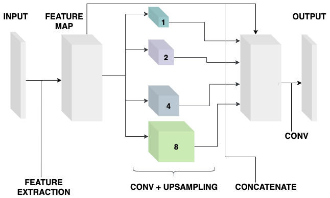

Each pixel is classified into one of the following classes :
1. Vegetation
2. Built-up
3. Open land
4. Roads
5. Waterbodies

The proposed study makes use of multispectral satellite imagery collected by the Sentinel-2 mission. The data collected was of 16-bit 6 type, covering the study area, and four 10 m spatial resolution bands of Sentinel-2, i.e., B2 (490 nm), B3 (560 nm), B4 (665 nm) and B8 (842 nm) are considered. The input's dimensions are 256 x 256 x 4, which means we use a height and width of 256. Some examples are given below.

&nbsp; &nbsp; 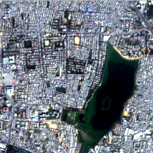 &nbsp;&nbsp;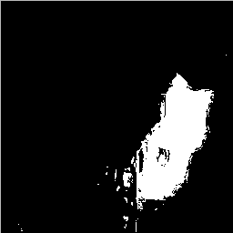&nbsp;&nbsp; 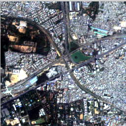 &nbsp;&nbsp;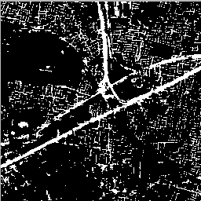

&nbsp; &nbsp; 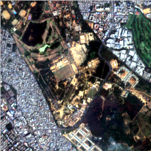&nbsp;&nbsp; 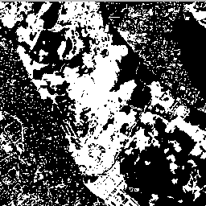 &nbsp;&nbsp;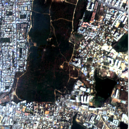 &nbsp;&nbsp;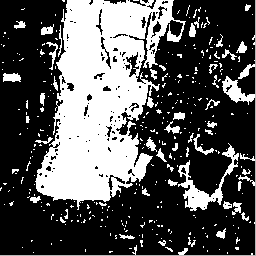

&nbsp; &nbsp; &nbsp; &nbsp; &nbsp; &nbsp; &nbsp; &nbsp; &nbsp; &nbsp; &nbsp; &nbsp; &nbsp; &nbsp; &nbsp; &nbsp; &nbsp; &nbsp; 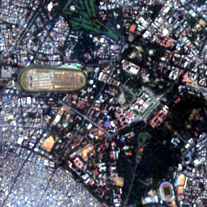 &nbsp;&nbsp;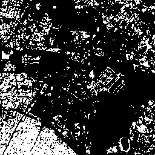


Apart from the PSPNet model, UNET and FCN models have also been implemented.


## Quick Start

### Install

1. git clone the repository.

    ```git clone https://github.com/suryadheeshjith/ISRO_Repo.git```

2. Create a new environment for this project [OPTIONAL]. If you use conda, create an environment using this command.

    ```conda create -n ISRO python=3.6.10```

3. Install the required packages from requirements.txt.

    ```pip install -r requirements.txt```


Required Packages :

* Python==3.6.10
* numpy==1.18.1
* argparse
* scikit-learn==0.22.1
* scipy==1.4.1
* rasterio==1.1.5
* matplotlib==3.2.1
* json5==0.8.5
* tensorflow==1.15.2
* logger==1.4


#### Repository Structure


    ```
    .
    ├── README.md
    ├── figures
    ├── miniPSP
    │   ├── Data
    │   │   ├── Bands
    │   │   ├── Targets
    │   ├── models
    │   │   ├── __init__.py
    │   │   └── models.py
    │   |── utils
    │   │   ├── __init__.py
    │   │   ├── data_utils.py
    │   │   ├── logger_utils.py
    │   │   ├── metric_utils.py
    │   │   ├── model_utils.py
    │   │   ├── plot_utils.py
    │   │   ├── store_utils.py
    │   │   └── tiling_utils.py
    │   ├── patch_generator.py
    │   ├── test.py
    │   ├── train.py
    └── requirements.txt
    ```

The Data folder contains the Bands and the Targets folders. The Bands folder should contain the satellite image tiff files and the Targets should contain the target masks for each class. Once all the files are in place, we crop our images into patches.


### Patch Generation

To generate patches, we run the [patch_generator.py](https://github.com/suryadheeshjith/ISRO_Repo/blob/master/miniPSP/patch_generator.py) file.

##### List of Command-line Parameters

* -h, --help : show this help message and exit

* -d, --tdim : Dimensions of the patch size (Height/Width). Default = 256

* -i, --inpf : Input Folder containing the input tiff files. (Required)

* -o, --outf : Output folder to store the training .npy files. (Required)

* -tp, --threshp : Percentage ones in each tile. Enter value between 0 - 1 Default = 0.25

* -tr, --threshr : Threshold parameter while selecting tiles. Enter value between 0 - 10 Default = 8

* -str, --strides : Strides taken for tiling to obtain overlapping patches. Default = 0 (for non-overlapping patches)

* -tt, --traintest : Save separate files for training and testing. Default = False

* -s, --save : Save details of patches generated. Default = False


An example command would be

```python3 patch_generator.py -i Data -o Data -s```


### Model Training

Training the model will save a JSON file, a best weights and final weights file. Training is done by the [train.py](https://github.com/suryadheeshjith/ISRO_Repo/blob/master/miniPSP/train.py) file.

##### List of Command-line Parameters

* -h, --help : show this help message and exit

* -i, --inp : Input npy file path. (Required)

* -o, --out : Output npy file path. (Required)

* -mp, --mpath : Model path to save all required files for testing. (Required)

* -mn, --mname : Model name. Options : psp, unet or fcn. Default = psp

* -e , --epochs : Number of epochs. Default = 50

* -b, --batch : Batch size. Default = 8

* -tt, --traintest : Use Train Test split. Default = False

* -pl, --plot : Plot Accuracy and Loss graphs. Default = False


An example command would be

```python3 train.py -i Data/input.npy -o Data/output.npy -mp Model_test -tt -pl```

### Model Testing

Testing is done by the [test.py](https://github.com/suryadheeshjith/ISRO_Repo/blob/master/miniPSP/test.py) file.

##### List of Command-line Parameters

* -h, --help : show this help message and exit

* -i, --inp : Input npy file path. (Required)

* -o, --out : Output npy file path. (Required)

* -mj, --mjpath : Model JSON file path. (Required)

* -mw, --mwpath : Model weights file path. (Required)

* -mn, --mname : Model name. Options : psp, unet or fcn. Default = psp

* -tt, --traintest : Use Train Test split. Default = False

* -e. --eval : Evaluate the model and log the results. Default = False

* -pl, --plot : Plot confusion matrix. Default = False

* -s, --save : Save masks for each class. Default = False

An example command would be

```python3 test.py -mj Model_test/model.json -i Data/input.npy -o Data/output.npy -mw Model_test/model_final_weights.h5 -tt -e -pl```

## Additional Note

For prediction and subsequent generation of masks by the model, you must first generate patches for the entire image without any sampling or thresholding. This can be done by command

```python3 patch_generator.py -i Data -o Data -s -tp 0```

Then, to generate the masks

```python3 test.py -mj Model_test/model.json -i Data/input.npy -o Data/output.npy -mw Model_test/model_final_weights.h5 -s```


##### Contributors

1. Surya Dheeshjith
2. A. Suryanarayanan
3. Shyam A.

###### Last updated : 17 July 2020
